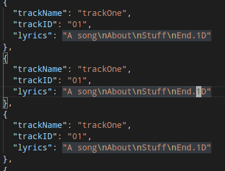

It might be my inner New Englander, but I _love_ a difficult thing. I've been learning
to use [Vim](<https://en.wikipedia.org/wiki/Vim_(text_editor)>) for the last 4 months. ~~I'm
not sure its actually made me any faster at writing code.~~ It has NOT made me any
faster at writing code, but it has changed the way I think about editing code. I still
mostly work in Vscode, but use the [Vscode](https://github.com/VSCodeVim/Vim) extension.

Here are the two things I learned today, while working on a lyrics guessing game
inspired by the brothers over at [MBMBAM](https://www.themcelroy.family/mbmbam).

## Incrementing Numbers

> <kbd>cntrl + a</kbd> Increments.
> <kbd>cntrl + x</kbd> Decrements.

While creating some dummy JSON files to use in development, I wanted to append number
tags to a lyrics field to id tracks in the 'lyrics display'. After copying and pasting
blocks of JSON information, I didn't really want to append the numbers to each line.

But I didn't have to increment each number each time! In comes **Visual Block** to
the rescue!

Then, after selecting all my numbers down the column, the command <kbd>g</kbd> +
<kbd>cntrl + a</kbd> will increment the numbers, creating a sequence. (note: using just
<kbd>cntrl + a</kbd> would increment all the numbers but not in sequence.)

## Cursor Placement after search.

Something I also found necessary was repeating an action on search results, but at a
specific location within the word. For example changing multiple variables from
`setSign` to `setNumberSign`.

While <kbd>c</kbd><kbd>a</kbd><kbd>w</kbd> + `setNumberSign` in combination with <kbd>.</kbd> would probably be the fastest way here. But for the sake of argument (because I can't think of a different use pattern at the moment.) I'll demonstrate an alternative.

After entering search mode, I enter the query (`/setSign`) to find all instances of
`setSign`. Then by appending `/b+3` to my search, the cursor will land on the `S`.
Entering `/e` after a search will place the cursor at the end of the result.

Furthermore `/e+3` would place the cursor 3 spaces after the end.

So an alternative to using <kbd>c</kbd><kbd>a</kbd><kbd>w</kbd>,
<kbd>n</kbd>,<kbd>.</kbd> _could_ be:

> `/setSign/b+3`,<kbd>i<kbd>`Number`

followed by using <kbd>n</kbd> to get the next search result, and <kbd>.</kbd> to
<kbd>.</kbd> repeat the insertion.

Pretty cool.

Well, now that I've spent all this time writing this post, I can assuredly say, that
Vim has made me significantly slower at getting work done. Oh well.
